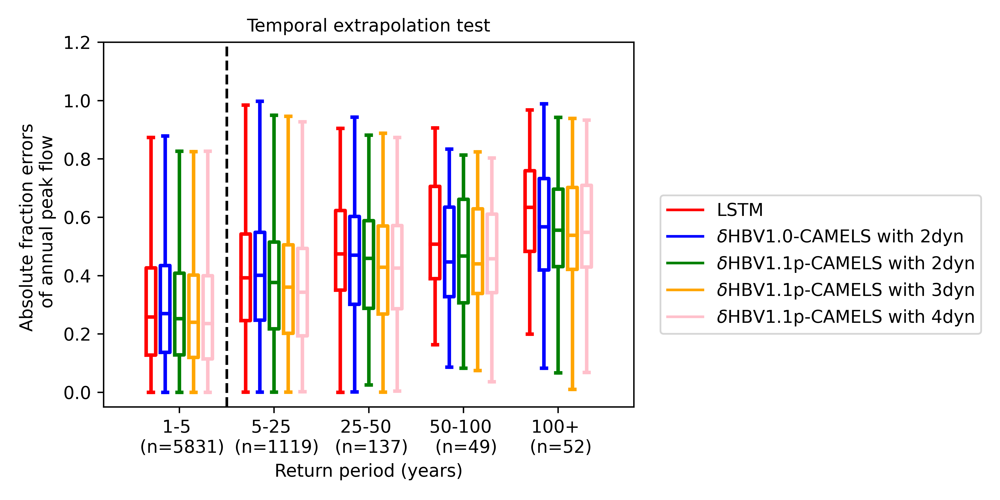

# 𝛿MG: Generic Differentiable Modeling Framework

[](https://www.python.org/downloads/)
[](https://pytorch.org/)
[](https://github.com/astral-sh/ruff)

[](https://github.com/mhpi/generic_deltamodel/actions/workflows/pytest.yaml)
[](https://doi.org/10.5281/zenodo.14868671)

---

A generic framework for building [differentiable models](https://www.nature.com/articles/s43017-023-00450-9). 𝛿MG enables seamless coupling of neural networks with differentiable process-based equations, leveraging PyTorch's auto-differentiation for efficient, large-scale optimization on GPU. The spiritual successor to [HydroDL](https://github.com/zhonghu17/HydroDL), 𝛿MG generalizes differentiable modeling for cross-domain application while also imposing basic standardizations for research-to-operations pipelines.

### Key Features

- 🤝 **Hybrid Modeling**: Combine neural networks with process-based equations for enhanced interpretability and generalizability. Instead of manual model parameter calibration, for instance, use neural networks to directly learn robust and interpretable parameters ([Tsai et al., 2021](https://doi.org/10.1038/s41467-021-26107-z)).
- 🔁 **PyTorch Integration**: Scale with PyTorch for efficient training and compatibility with modern ML tools and numerical solvers.
- 🧩 **Modular Plugin Architecture**: Swap in domain-specific components and configurations with ease.
- ⚡ **Benchmarking**: All in one place. 𝛿MG + hydroDL2 will enable rapid deployment and replication of key published MHPI results.
- 🌊 **NextGen-ready**: Designed for [CSDMS BMI](https://csdms.colorado.edu/wiki/BMI) compliance to support differentiable hydrological models in [NOAA-OWP](https://water.noaa.gov/about/owp)'s [NextGen National Water Modeling Framework](https://github.com/NOAA-OWP/ngen). See the NextGen-ready [𝛿HBV2.0](https://github.com/mhpi/dHBV2.0) with 𝛿MG-supported BMI for an example.

</br>

𝛿MG is designed to scale with modern deep learning tools (e.g., foundation models) while maintaining physical interpretability. Our peer-reviewed and published [benchmarks](https://mhpi.github.io/benchmarks/#10-year-training-comparison) show that well-tuned differentiable models can match deep networks in performance—while better extrapolating to extreme or data-scarce conditions and predicting physically meaningful variables.

Differentiable modeling introduces more modeling choices than traditional deep learning due to its physical constraints. This includes learning parameters, missing process representations, corrections, or other enhancements for physical models.

**Note**: While differentiable models are powerful and have many desirable characteristics, they come with a larger decision space than purely data-driven neural networks since physical processes are involved, and can thus feel "trickier" to work with. Hence, *we recommend* beginning with our example [notebooks](./example/hydrology/) and then systematically making changes, one at a time. Pay attention to multifaceted outputs, diverse causal analyses, and predictions of untrained variables permitted by differentiable models, rather than purely trying to outperform other models' metrics.

</br>

This work is mantained by [MHPI](http://water.engr.psu.edu/shen/) and advised by [Dr. Chaopeng Shen](https://water.engr.psu.edu/shen/). If you find it useful, please cite (dedicated citations are coming):

    Shen, C., et al. (2023). Differentiable modelling to unify machine learning and physical models for geosciences. Nature Reviews Earth & Environment, 4(8), 552–567. <https://doi.org/10.1038/s43017-023-00450-9>.

</br>

## Installation

To install 𝛿MG, clone the repo and install in developer mode with [Astral UV](https://docs.astral.sh/uv/):

    ```bash
    git clone git@github.com:mhpi/generic_deltamodel.git
    uv pip install -e ./generic_deltamodel
    ```

Pip and Conda are also supported, though UV is recommended. See [setup](./docs/setup.md) for further details.

</br>

## Quick Start

See [how to run](./docs/how_to_run.md).

**Example -- Differentiable Parameter Learning**: Use an LSTM to learn parameters for the [HBV](https://en.wikipedia.org/wiki/HBV_hydrology_model) hydrological model.

    ```python
    from hydrodl2.models.hbv.hbv import Hbv

    from dmg.core.data.loaders import HydroLoader
    from dmg.core.utils import load_nn_model, print_config, set_randomseed
    from dmg.models.delta_models import DplModel
    from example import load_config, take_data_sample

    CONFIG_PATH = '../example/conf/config_dhbv.yaml'


    # Model configuration
    config = load_config(CONFIG_PATH)

    # Initialize physical model and NN.
    phy_model = Hbv(config['model']['phy'])
    nn = load_nn_model(config['model'], phy_model)

    # Create differentiable model dHBV: a torch.nn.Module that describes how
    # the NN is linked to the physical model HBV.
    dpl_model = DplModel(phy_model=phy_model, nn_model=nn)

    # Load dataset of NN and HBV inputs.
    dataset = HydroLoader(config).dataset
    dataset_sample = take_data_sample(config, dataset, days=730, basins=100)

    output = dpl_model(dataset_sample)
    ```

This exposes a key characteristic of the differentiable model `DplModel`: composition of a physical model, `phy_model`, and a neural network, `nn`. Internally, `DplModel` looks like

    ```python
    # NN forward
    parameters = self.nn_model(dataset_sample['xc_nn_norm'])

    # Physics model forward
    predictions = self.phy_model(
        dataset_sample,
        parameters,
    )
    ```

Check out [examples](https://github.com/mhpi/generic_deltamodel/tree/master/example/hydrology) to see model training/testing/simulation in detail. We recommend starting with the [δHBV 1.0 tutorial](./example/hydrology/example_dhbv_1_0.ipynb), which can also be run in a [Colab Notebook](https://colab.research.google.com/drive/19PRLrI-L7cGeYzkk2tOetULzQK8s_W7v?usp=sharing) to leverage online compute.

</br>

## Use Cases

### 1. Lumped Hydrology

Lumped differentiable rainfall-runoff models [𝛿HBV 1.0](https://agupubs.onlinelibrary.wiley.com/doi/epdf/10.1029/2022WR032404) and improved [𝛿HBV 1.1p](https://essopenarchive.org/doi/full/10.22541/essoar.172304428.82707157).

### 2. Unseen Extreme Events Test with 𝛿HBV 1.1p

In the unseen extreme events spatial test, we used water years with a 5-year or lower return period peak flow from 1990/10/01 to 2014/09/30 for training, and held out the water years with greater than a 5-year return period peak flow for testing. The spatial test was conducted using a 5-fold cross-validation approach for basins in the [CAMELS dataset](https://gdex.ucar.edu/dataset/camels.html). This application has been benchmarked against LSTM and demonstrates better extrapolation abilities. Find more details and results in [Song, Sawadekar, et al. (2024)](https://essopenarchive.org/doi/full/10.22541/essoar.172304428.82707157).



### 3. National-scale Water Modeling

A national-scale water modeling study on approximately 180,000 river reaches (with a median length of 7 km) across CONUS using the high-resolution, multiscale, differentiable water model 𝛿HBV 2.0. This model is also operating at global-scales and has been used to generate high-quality, seamless simulations for the entire CONUS. Find more details and results in [Song, Bindas, et al. (2025)](https://agupubs.onlinelibrary.wiley.com/doi/pdf/10.1029/2024WR038928).


### 4. Global-scale Photosynthesis Modeling

Currently in development. Find more details and results in [Aboelyazeed et al. (2024)](https://doi.org/10.22541/au.173101418.87755465/v1).


</br>

## Ecosystem Integration

- **HydroDL 2.0 ([`hydrodl2`](https://github.com/mhpi/hydrodl2))**: Home to MHPI's suite of process-based hydrology models and differentiable model augmentations.
<!-- - **HydroData ([`hydro_data_dev`](https://github.com/mhpi/hydro_data_dev))**: Data extraction, processing, and management tools optimized for geospatial datasets. (In development) -->
<!-- - **Config GUI ([`GUI-Config-builder`](https://mhpi-spatial.s3.us-east-2.amazonaws.com/mhpi-release/config_builder_gui/Config+Builder+GUI.zip))([Source](https://github.com/mhpi/GUI-Config-builder))**: An intuitive, user-friendly tool designed to simplify the creation and editing of configuration files for model setup and development. -->
- **Differentiable Ecosystem Modeling ([`diffEcosys (dev version only)`](https://github.com/hydroPKDN/diffEcosys/))**: A physics-informed machine learning system for ecosystem modeling, demonstrated using the photosynthesis process representation within the Functionally Assembled Terrestrial Ecosystem Simulator (FATES) model. This model is coupled to NNs that learn parameters from observations of photosynthesis rates.
- **Other Development**: Many additions are currently in the progress: (i) numerical PDE solvers on PyTorch, torchode, torchdiffeq; (ii) [adjoint](https://doi.org/10.5194/hess-28-3051-2024) sensitivity; (iii) extremely efficient and highly accurate surrogate models for process-based equations; (iv) data assimilation methods; (v) downscaled and bias-corrected climate data; (vi) mysteriously powerful neural networks, and more ...

</br>

## 𝛿MG Architecture

- **Data Loaders**: Bulk data preprocessors customized per dataset.
- **Data Samplers**: Dataset samplers for minibatching during model training and inference.
- **Trainers**: Orchestrates high-level model training, testing, and simulation.
- **ModelHandler**: Manages multimodeling, multi-GPU computation, and other high level operations. Acts as an drop-in model interface for CSDMS BMI or other R2O wrappers.
- **Delta Models**: Differentiable models; describes how NNs and physical models are coupled (e.g., `DplModel` for parameter learning).

</br>

## Repo

    ```text
    .
    ├── src/dmg/
    │   ├── __main__.py                 # Runs 𝛿MG; models, experiments
    │   ├── core/
    │   │   ├── calc/                   # Calculation utilities
    │   │   ├── data/                   # Data loaders and samplers
    │   │   ├── logging/                # Utilities for Tensorboard and W&B logging
    │   │   ├── post/                   # Post-processing utilities; plotting
    │   │   └── utils/                  # Helper functions
    │   ├── models/
    │   │   ├── criterion               # Loss functions
    │   │   ├── delta_models            # Differentiable model modalities
    │   │   ├── multimodels             # Multimodeling processors
    │   │   ├── neural_networks/        # Neural network architectures
    │   │   ├── phy_models/             # Physical Models
    │   │   └── model_handler.py        # High-level model manager
    │   └── trainers/                   # Model training routines
    ├── conf/
    │   ├── hydra/                      # Hydra settings
    │   ├── observations/               # Observation configuration files
    │   ├── config.py                   # Configuration validator
    │   └── default.yaml                # Default master configuration file
    ├── docs/
    └── example/                        # Tutorials
    ```

</br>

## Contributing

We welcome contributions! Please submit changes via a fork and pull requests. For more details, refer to [docs/CONTRIBUTING.md](./docs/CONTRIBUTING.md).

---

*Please submit an [issue](https://github.com/mhpi/generic_deltamodel/issues) to report any questions, concerns, bugs, etc.*
